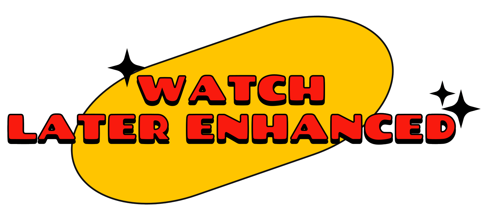

<div align="center">
  

  <h1>Watch Later Enhanced ✨</h1>

  <p>A high-performance, lightweight browser extension engineered to optimize the YouTube "Watch Later" experience through smart event delegation and asynchronous state management.</p>

  <a href="https://chromewebstore.google.com/detail/watch-later-enhanced/pkepecmnomlcbmemeochebfonchhdpfb">
    
  </a>
  
  
  

  <br /><br />

  [](https://ko-fi.com/adaddariodev)
  
  </div>

  

---

## 📋 Overview

**Watch Later Enhanced** is a productivity-focused web extension designed to remove the friction of YouTube's native playlist management. Instead of navigating through multiple dropdown menus, WLE injects a custom logic layer allowing users to instantly save videos to a local queue using a simple `Alt + Click` shortcut, complete with immediate visual and auditory feedback.

## 🛠 Technical Stack & Architecture

This project is built entirely in **Vanilla JavaScript**, ensuring zero-dependency overhead, maximum execution speed, and minimal memory footprint within the browser.

* **Standard:** Adheres to **Manifest V3**, utilizing declarative permissions for enhanced security.
* **Data Management:** Stateless communication utilizing `chrome.storage.local` to sync data seamlessly between the Content Script and the Popup UI.
* **Zero External Dependencies:** Built natively with Fetch API, DOM API, and Web Audio API.

## 🚀 Engineering Highlights

* **Advanced Event Delegation:** Instead of attaching hundreds of listeners to dynamically loaded YouTube thumbnails, the extension uses a single global event listener on the document object, significantly reducing CPU idle usage and preventing memory leaks.
* **Graceful Degradation (Title Extraction):** WLE implements a robust dual-strategy for data retrieval. It primarily fetches clean metadata via YouTube's `oembed` API. If the network request fails, it instantly falls back to an **Aggressive DOM Parsing** strategy, iterating through 4 different selector layers (`aria-label`, `img alt`, etc.) to guarantee a result.
* **Asynchronous UI State Management:** The custom injected HUD handles rapid user inputs and race conditions gracefully. Global timeouts are cleared and reset dynamically to prevent UI flickering or overlapping animations during consecutive saves.

## ⚙️ Installation

### From Chrome Web Store (Recommended)
1. Go to the [Chrome Web Store Page](https://chromewebstore.google.com/detail/pkepecmnomlcbmemeochebfonchhdpfb?utm_source=item-share-cb).
2. Click **"Add to Chrome"**.

### Manual Installation (For Developers)
1. Clone this repository: `git clone https://github.com/adaddariodev/Watch-Later-Enhanced-webplugin.git`
2. Open Chrome and navigate to `chrome://extensions/`
3. Enable **Developer mode** in the top right corner.
4. Click **Load unpacked** and select the cloned directory.

## 🏗 Project Structure

```text
.
├── icons/              # Required extension icons (48px, 128px)
├── imgs/               # Promotional assets, high-res logos, and store banners
├── sounds/             # Audio feedback assets (success.wav, click.wav)
├── .gitattributes      # Git configuration
├── content.css         # UI layer: Glassmorphism HUD and animations
├── content.js          # Core logic: Event delegation, API fetch, DOM parsing
├── manifest.json       # Extension configuration & V3 permissions
├── popup.css           # Styling for the popup UI
├── popup.html          # Extension popup interface
├── popup.js            # Storage reader and list management
└── README.md           # Project documentation
```

## 🤝 Contributing

This project was built to solve a specific problem, but I am totally open to contributions! Whether it's refactoring, adding new features, or optimizing the DOM parsing logic, feel free to fork the repo and submit a Pull Request.

## 📄 License

Distributed under the MIT License. See LICENSE for more information.

---
<div align="center">
  <b>Built with ❤️ by <a href="https://github.com/adaddariodev">Antonio D'Addario</a></b>
</div>
