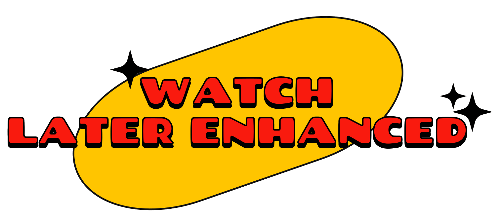

<div align="center">
  

  <h1>Watch Later Enhanced</h1>

  <p><strong>Save any YouTube video with <code>Alt + left click</code>. Watch it in a floating window that outlives the browser.</strong><br/>
  A zero-dependency Manifest V3 extension. Your list never leaves your machine.</p>

  <a href="https://chromewebstore.google.com/detail/watch-later-enhanced/pkepecmnomlcbmemeochebfonchhdpfb">
    
  </a>
  
  
  
  

  <br /><br />

  [](https://ko-fi.com/adaddariodev)

</div>

---

## Why it exists

YouTube's own "Watch Later" costs you three clicks, a dropdown and a page you
did not want to load — and then the list only works on YouTube. Most videos
saved that way are never seen again.

Watch Later Enhanced replaces that with one gesture. Hold `Alt`, left click any
thumbnail, and it is on your list — no navigation, no dropdown, no page load.
The list lives in your browser toolbar, reachable from any site.

## What it does

### Save without leaving the page

`Alt + left click` any thumbnail, or the player itself, and the video is saved. A
small HUD confirms it with the video's real title, pulled from the page or from
YouTube's oEmbed endpoint if the page does not offer one.

### Watch it in a window of its own

Pop any video out of the browser into a floating mini player. Minimize the
browser, move to another app, drag the window anywhere — it keeps playing.

* **From any thumbnail, without opening it:** `Alt + Shift + left click` it — the
  gesture that saves a video, with Shift. Or pick **Play in mini player** from
  the video's own ⋮ menu. Or hover the thumbnail and use the button in its
  top-left corner.
* **On a video page:** `Alt + Shift + left click` the player, or the mini-player
  button in YouTube's control bar. The window opens at the second the page had
  reached, and the page stops playing — one video at a time, never two.
* **From the popup:** the mini-player button on a saved video plays it
  immediately in a dedicated window — no tab, nothing to confirm. **Pin on
  top** in its corner promotes it to the floating kind.
* **While detached:** `Space`/`K` play and pause, `←` `→` seek five seconds,
  `M` mutes, `Esc` closes. Closing and returning to the tab also sit in the
  browser's own title bar on that window, so the overlay does not repeat them —
  it shows the video's title and a **Pinned** badge, and fades out of the way.

There is only ever one mini player: asking for the video already in it brings
that window forward, and asking for another puts it in the same window. It is a
window of its own, so closing the page it came from leaves it playing.

> The pin is a button rather than a setting because it has to be: a browser
> only grants an always-on-top window in response to a click inside the page,
> so no preference can ask for one on your behalf.

### Organise it the way you think

* **Search that looks at titles and tags** at once, for the two things anyone
  remembers about a saved video. The box folds into the filter row when nothing
  is being searched for, and never while it is filtering.
* **Click a channel name** under any video to see only what you saved from it —
  or a tag, to see only what carries it. Either writes what it did into the
  search box (`channel:Fireship`, `tag:music`), which you can also type.
* **Tags**, colour-derived from their own name, with autocomplete.
* **A numbered queue** — every card shows its place in the list, counting from
  1, and takes its new number the moment it is moved. Hover the card and the
  number becomes the grip you drag it by, in the same spot, so a number costs
  the title nothing.
* **Drag and drop** to set your own order.
* **To Watch / Archive / Trash**, so finished videos leave the queue without
  disappearing, and deletions are recoverable.
* **Video and Shorts labels**, with a filter that narrows the list to either.
* **The channel** that published each video, beside its type — and clickable.
* **Favourites** — a heart per row, and a filter that narrows whatever the
  type chips and the tag search are already showing.
* **A sound mixer** — a level and an on/off per sound, or silence for the lot.
* **Colours you choose** — every colour the extension invents for itself comes
  from one setting: a colour per name worked out from its letters, one neutral
  for everything, or a single HEX code you give it. A light one flips the
  lettering to dark so a pale tag stays readable.
* **A glass finish** — a slider that turns the cards, the toolbar and the
  settings panel into frosted panes over a lit backdrop, at whatever strength
  you want, and draws none of it at zero.
* **A popup the size of your screen** — about three quarters of the height it
  has spare, between 400px and the 600 a browser will draw.

### Know what you saved

A **Video** or **Shorts** label and the **channel name** sit on one line under
every title, with your own tags on a line of their own below them.
Because YouTube serves the same Short behind both `/shorts/` and `/watch`
links, the type is worked out from the URL, then from the page around the
thumbnail, and finally — when neither settles it — by asking YouTube in the
background and correcting the label a moment later. The channel comes from the
page when it is there and from YouTube's `oembed` payload when it is not.

Items saved before a detail existed are filled in a few at a time while you
browse YouTube, rather than left permanently blank.

### Read the manual without leaving the extension

Settings opens a bundled user guide: searchable, with a table of contents that
tracks your scroll position, a full shortcut reference and troubleshooting.
It ships inside the extension, so it works offline. Beside it, **What's new**
links to the releases on GitHub, and the version you are running is printed at
the foot of the panel — read from the manifest, so it cannot disagree with
what you have installed.

## Shortcuts

| Shortcut | Where | What it does |
| --- | --- | --- |
| `Alt + left click` | Any YouTube thumbnail | Saves it without opening it |
| `Alt + left click` | The video player | Saves what you are watching |
| `Alt + Shift + left click` | Any thumbnail or title | Plays it in the mini player, without opening it |
| `Alt + Shift + left click` | The player on a video page | Opens it in the mini player, from where the page had reached |
| `/` | The popup | Opens the search box |
| `Esc` | The search box | Clears it and folds it away |
| `Space` or `K` | Mini player | Play / pause |
| `←` / `→` | Mini player | Back / forward 5 seconds |
| `M` | Mini player | Mute / unmute |
| `Esc` | Mini player | Close and return the video to the tab |
| `Enter` / `Esc` | Tag box | Add the tag / close without adding |

## Privacy

There is no server behind this extension. No account, no sign-in, no telemetry,
no analytics, no sync. Your list is held in `chrome.storage.local` on your own
machine and is never transmitted anywhere.

Every outbound request the extension makes, in full:

| To | When | What it carries |
| --- | --- | --- |
| `youtube.com/oembed` | Saving a video whose title the page did not provide | The video URL |
| `youtube.com/shorts/<id>` | Saving, to tell a Short from a video | The video ID |

That is the complete list. Both go to YouTube, only while you are already on
YouTube, and carry nothing about you beyond the video you just saved. Nothing
reaches any other party: the Inter typeface is
[bundled with the extension](fonts/) rather than fetched from Google, so
opening the popup makes no request at all.

The page's own Content Security Policy enforces it — `style-src 'self';
font-src 'self';` — so a remote stylesheet or font could not load even if one
were added by mistake.

Permissions requested: **`storage`**. That is the whole list — no host
permissions, no tabs, no scripting.

## Install

**From the Chrome Web Store** —
[add it here](https://chromewebstore.google.com/detail/watch-later-enhanced/pkepecmnomlcbmemeochebfonchhdpfb).

**From source**

```bash
git clone https://github.com/adaddariodev/Watch-Later-Enhanced-webplugin.git
```

Then open `chrome://extensions/`, turn on **Developer mode**, click
**Load unpacked**, and select the cloned directory.

Requires Chrome 116+ for the detached mini player (older versions fall back to
the classic Picture-in-Picture). Firefox 109+ is supported.

## How it is built

Vanilla JavaScript, no build step, no dependencies, no framework. Clone it and
it runs.

* **Manifest V3**, with `storage` as the only permission.
* **One delegated listener** on `document` handles every thumbnail on the page,
  rather than binding to each of the hundreds YouTube creates and destroys as
  you scroll. Nothing to clean up, nothing to leak.
* **Structural matching, not component names** — a thumbnail is recognised as a
  link to a video at the size and shape of a picture, never as
  `ytd-thumbnail` or `ytLockupViewModelContentImage`. Those names differ per
  surface and change without notice; that shape does not. Where something has
  to be found inside YouTube's own UI, it is found by its ARIA role — the ⋮
  menu is `[role="menu"]`, and the row added to it is a clone of one of its
  own, so it inherits whatever styling that menu is wearing.
* **Layered title extraction** — the page's own DOM first (with selectors for
  the Shorts view model, which stores its title somewhere else entirely), then
  YouTube's `oembed` endpoint as a fallback. Title and channel share one
  memoised `oembed` call rather than one each, and everything is asked of the
  page's own origin so it works on `m.youtube.com` too.
* **Layered type detection** — the URL, then the DOM around the click, then a
  same-origin redirect check, memoised per video and bounded by a timeout.
* **Optimistic writes with a snapshot guard** — every read-modify-write on the
  list re-reads before committing and retries on conflict, so the popup and a
  YouTube tab saving at the same moment cannot drop each other's changes.
* **A render window** — the list is drawn a chunk at a time, the next fetched
  by an `IntersectionObserver` a screen ahead of the fold, so the cost of the
  full rebuild each change triggers is the cost of what is on screen rather
  than of everything saved. The window never shrinks while the list is the
  same one, because the browser keeps your scroll position across a rebuild
  only while the content is still as tall.
* **A mini player that outlives its opener** — every way in opens a real
  browser window, owned by the service worker rather than by the page that
  asked for it, so closing that page leaves it playing. It is a window because
  it has to be: a
  [Document Picture-in-Picture](https://developer.chrome.com/docs/web-platform/document-picture-in-picture)
  window belongs to the document that opened it and dies with it. What is
  given up is the hand-off of the already-decoded `<video>`, so the window
  starts at the second the page had reached rather than receiving the frame
  itself.
* **Document PiP for the pin, and only for it** — **Pin on top** is the one
  place a floating always-on-top player earns its ownership problem, and the
  window it came from minimizes rather than closes so there is something for
  it to belong to. It is a button rather than a setting because a browser only
  grants that window in answer to a click inside the page.
* **One mini player, serialised in the worker** — requests queue behind each
  other there, so a double-click cannot race two windows into existence; the
  second either focuses the window already showing that video or replaces what
  is in it.

## Project structure

```text
.
├── fonts/              # Inter, bundled (woff2 + OFL licence) — no CDN
├── icons/              # Extension icons (48px, 128px) and button glyphs
├── imgs/               # Logos and store banners
├── sounds/             # popup-click.mp3, video-saved.mp3
├── content.js          # Saving, title extraction, type detection, HUD
├── content.css         # In-page HUD and injected button styles
├── detach.js           # Detached mini player (Document Picture-in-Picture)
├── detach.css          # Mini player window styling
├── popup.html/.css/.js # The list: tags, search, filters, drag reorder
├── wiki.html/.css/.js  # Built-in user guide, opened from Settings
├── url-utils.js        # Shared URL parsing and validation
├── manifest.json       # Manifest V3 configuration
├── CHANGELOG.md        # Release history
└── README.md
```

## Contributing

Issues and pull requests are welcome — refactors, new features, or sharper
selectors for YouTube's ever-changing DOM. Fork it and open a PR.

## License

MIT. See [LICENSE](LICENSE).

The bundled **Inter** typeface is © The Inter Project Authors, licensed under
the SIL Open Font License 1.1 — see [`fonts/OFL.txt`](fonts/OFL.txt).

---
<div align="center">
  <b>Built with ❤️ by <a href="https://github.com/adaddariodev">adaddariodev</a></b>
</div>
